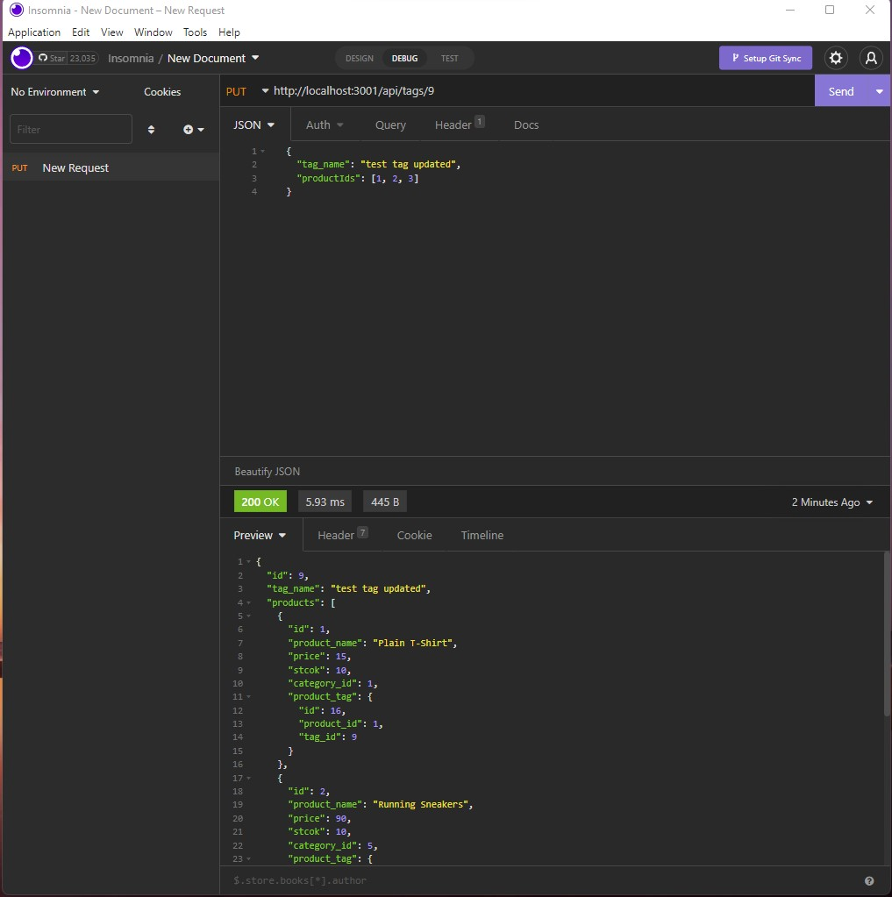

# E-Commerce-Back-End

## Task

Internet retail, also known as e-commerce, is the largest sector of the electronics industry, generating an estimated $29 trillion in 2019. E-commerce platforms like Shopify and WooCommerce provide a suite of services to businesses of all sizes. Due to their prevalence, understanding the fundamental architecture of these platforms will benefit you as a full-stack web developer.

Your task is to build the back end for an e-commerce site by modifying starter code. You’ll configure a working Express.js API to use Sequelize to interact with a MySQL database.

## Installation Instrustions

### You will have to install the following for the application to function:

    - mysql -u root -p
    - source db/schema.sql
    - npm i && npm run seed && npm start

# Walkthrough Video

A walkthrough video can be viewed through the [link](https://drive.google.com/file/d/1AFkhXOvwDibREW2vOCKwG7ynW3_JTd95/view)

# Screenshot

